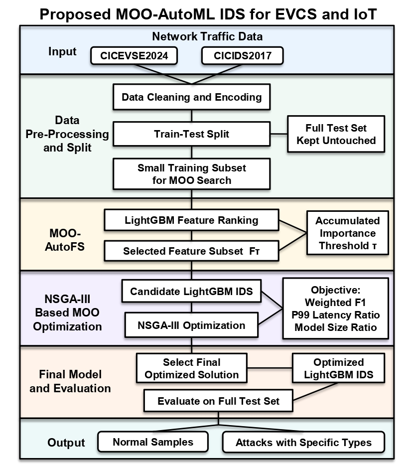

# MOO-NSGA-III-AutoML-based-Intrusion-Detection-System

This repository includes the code and datasets for the paper **"[A Multi-Objective AutoML-based Efficient Intrusion Detection System for EV Charging Networks](https://arxiv.org/abs/2608.02274)"** accepted at the **2026 IEEE Global Communications Conference (GLOBECOM 2026)**.

In this work, we propose a deployment-aware Multi-Objective Optimization and Automated Machine Learning (**MOO-AutoML**) framework for accurate and efficient intrusion detection in Electric Vehicle Charging Systems (**EVCSs**), Internet of Things (**IoT**) systems, and general networks. The framework combines lightweight training, LightGBM-based automated feature selection, and NSGA-III-based multi-objective optimization to balance intrusion detection performance, inference latency, and model size.

**Author:** Li Yang  
**Organizations:**
- Advanced Networking Technology and Security (ANTS) Lab, Faculty of Business and Information Technology, Ontario Tech University
- Optimized Computing and Communications (OC2) Lab, Department of Electrical and Computer Engineering, Western University

**Contact:** [li.yang@ontariotechu.ca](mailto:li.yang@ontariotechu.ca)

The paper is publicly available at: [arXiv](https://arxiv.org/pdf/2608.02274)
> The IEEE Xplore and DOI links will be added after the paper is published.

## Abstract of the Paper

Electric Vehicle Charging Systems (EVCSs) are increasingly connected with Internet of Things (IoT) devices, which improves charging intelligence but also expands their exposure to cyber-attacks. Intrusion Detection Systems (IDSs) are essential for securing EV charging networks; however, conventional Machine Learning (ML)-based IDSs often rely on manual model design and mainly optimize detection performance without fully considering inference latency and model size. In this paper, a Multi-Objective Automated ML (MOO-AutoML)-based efficient IDS is proposed for EVCS security. The proposed framework uses a lightweight training strategy and a LightGBM-based automated feature selection method to select compact feature subsets based on accumulated feature importance. Then, Non-dominated Sorting Genetic Algorithm III (NSGA-III) jointly optimizes the feature selection threshold and key LightGBM hyperparameters under three objectives: maximizing weighted F1-score, minimizing 99th percentile inference latency ratio, and minimizing model size ratio. Experiments on CICEVSE2024 and CICIDS2017 show that the proposed MOO-AutoML IDS achieves competitive weighted F1-scores, lower P99 inference latency, and smaller model sizes than the compared methods. Overall, the results indicate that the proposed method can support accurate and efficient intrusion detection for EVCS and IoT security under practical deployment constraints.

<p align="center">
  
</p>

## MOO-AutoML Pipeline and Procedures

1. **Data Pre-Processing and Efficient Training**
   - Data cleaning and label encoding
   - Train-test separation
   - Small training subsets for efficient MOO search
   - Complete test sets reserved for final evaluation

2. **Multi-Objective Automated Feature Selection (MOO-AutoFS)**
   - LightGBM-based feature ranking
   - Accumulated feature-importance calculation
   - Automated optimization of the accumulated-importance threshold
   - Selection of a compact and informative feature subset

3. **NSGA-III-based Multi-Objective Optimization**
   - Joint optimization of the feature-selection threshold and LightGBM hyperparameters
   - Maximization of weighted F1-score
   - Minimization of P99 inference latency ratio
   - Minimization of model size ratio
   - Generation of Pareto-optimal IDS solutions

4. **Final Model Selection and Evaluation**
   - Selection of a deployment-oriented solution from the Pareto front
   - Final LightGBM model training
   - Evaluation on the complete held-out test set

## Datasets

The datasets are not uploaded to GitHub because they are very large.   
**They can be downloaded through this link**: [OneDrive Datasets](https://ontariotechu-my.sharepoint.com/:f:/g/personal/li_yang_ontariotechu_ca/IgCbiW9Q0kdmRJbsDLuVoIfYASwttxAU8-Eo5f1hb9sTyDc?e=oa5LKe)

### 1. CICEVSE2024

CICEVSE2024 is an EV charging station cybersecurity dataset containing benign traffic and multiple EVCS attack scenarios. This work uses its network traffic data.

Official dataset page: [CIC EV Charger Attack Dataset 2024](https://www.unb.ca/cic/datasets/evse-dataset-2024.html)

### 2. CICIDS2017

CICIDS2017 is a widely used network intrusion detection dataset containing benign traffic and multiple modern attack categories.

Official dataset page: [CICIDS2017](https://www.unb.ca/cic/datasets/ids-2017.html)

All CSV files contain a target column named `Label`. The provided training files are compact subsets used for model development and multi-objective search, while the complete test files are used for final evaluation.

## Code

- [`MOO_AutoML_CICEVSE2024_Dataset1.ipynb`](https://github.com/LiYangHart/MOO-NSGA-III-AutoML-based-Intrusion-Detection-System/blob/main/MOO_AutoML_CICEVSE2024_Dataset1.ipynb): implementation and evaluation of the proposed MOO-AutoML IDS on CICEVSE2024.
- [`MOO_AutoML_CICIDS2017_Dataset2.ipynb`](https://github.com/LiYangHart/MOO-NSGA-III-AutoML-based-Intrusion-Detection-System/blob/main/MOO_AutoML_CICIDS2017_Dataset2.ipynb): implementation and evaluation of the proposed MOO-AutoML IDS on CICIDS2017.

Both notebooks include baseline model evaluation, LightGBM feature ranking, MOO-AutoFS, NSGA-III optimization, Pareto-front analysis, final model selection, and full test-set evaluation.

## Requirements

The required Python packages are listed in [`requirements.txt`](requirements.txt). Major dependencies include:

- Python 3.7+
- NumPy
- pandas
- Matplotlib
- seaborn
- scikit-learn
- XGBoost
- LightGBM
- Optuna
- joblib
- Jupyter Notebook or JupyterLab

## Installation

Create and activate a new virtual Python environment from the repository root.

```bash
python -m venv .venv
```

Activate it:

```bash
# Windows
.venv\Scripts\activate

# macOS or Linux
source .venv/bin/activate
```

Install the required packages and start Jupyter:

```bash
python -m pip install --upgrade pip
python -m pip install -r requirements.txt
jupyter notebook
```

### Running the Code

1. Keep the two notebooks and `Framework.jpg` in the repository root.
2. Place the datasets downloaded from [OneDrive Datasets](https://ontariotechu-my.sharepoint.com/:f:/g/personal/li_yang_ontariotechu_ca/IgCbiW9Q0kdmRJbsDLuVoIfYASwttxAU8-Eo5f1hb9sTyDc?e=oa5LKe) (CSV files) in the `Data/` directory using the filenames shown above.
3. Install the required packages.
4. Open the relevant notebook and run all cells in order from a fresh kernel.

## Related Repositories

1. [Multi-Objective Optimization and AutoML-based Intrusion Detection System](https://github.com/Western-OC2-Lab/Multi-Objective-Optimization-AutoML-based-Intrusion-Detection-System)
2. [AutonomousCyber: AutoML-based Autonomous Intrusion Detection System](https://github.com/Western-OC2-Lab/AutonomousCyber-AutoML-based-Autonomous-Intrusion-Detection-System)
3. [AutoML and Adversarial Attack Defense for Zero Touch-Network-Security](https://github.com/Western-OC2-Lab/AutoML-and-Adversarial-Attack-Defense-for-Zero-Touch-Network-Security)

## Contact Information

Please feel free to contact the author regarding questions, research collaboration, or related opportunities.

- Email: [li.yang@ontariotechu.ca](mailto:li.yang@ontariotechu.ca)
- GitHub: [LiYangHart](https://github.com/LiYangHart) and [ANTS-OntarioTechU](https://github.com/ANTS-OntarioTechU)
- LinkedIn: [Li Yang](https://www.linkedin.com/in/li-yang-phd-65a190176/)
- Google Scholar: [Li Yang](https://scholar.google.com/citations?user=XEfM7bIAAAAJ&hl=en)

## Citation

If you find this repository useful in your research, please cite the paper as:

L. Yang, “A Multi-Objective AutoML-based Efficient Intrusion Detection System for EV Charging Networks," *GLOBECOM 2026 - 2026 IEEE Global Communications Conference*, 2026, Macau S.A.R., China, pp. 1-6.

```bibtex
@inproceedings{yang2026mooautomlevcs,
  author    = {Yang, Li},
  title     = {A Multi-Objective AutoML-based Efficient Intrusion Detection System for EV Charging Networks},
  booktitle = {2026 IEEE Global Communications Conference (GLOBECOM)},
  year      = {2026},
  pages     = {1-6}
}
```

The citation will be updated after the final IEEE publication information becomes available.

## Acknowledgment

This project was made possible in part through the support of the National Cybersecurity Consortium and the Government of Canada through the Cyber Security Innovation Network program.
